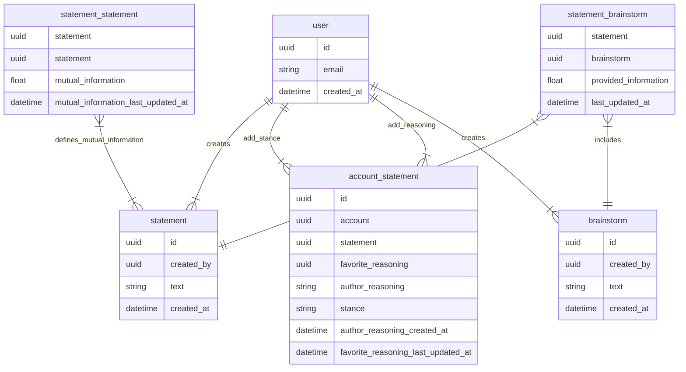

---
tags:
  - startup
  - software
---
We follow the guidelines written in [[Starting a New App]].

# Goal
We want to make more efficient the process of making a team / society wide decision. We abide by a few principles on the road to this goal:
1. Equality: all parties involved adhere to the same process of voicing opinions and validating each other's opinions. These will be evaluated on their contents, and not on their authors
2. Consensus: validation of ideas and opinions are built by consensus, rather than by a single "judge".
3. Consistency: we, as a platform, highlight conflicting beliefs, so that they can be addressed and resolved into a consistent set of beliefs.
4. Efficiency: we, as a platform, want to design processes that allow us to reach the truth efficiently and quickly. The platform should not get in the way of our people's thoughts.

# Model
This section describes the key concepts behind the platform

## Account
An account is the agent which takes actions on the platform, from submitting statements to brainstorming new ideas

## Statement
A statement is a sentence whose contents we want to falsify or prove

## Stance
A stance is a position taken on a stance. This will be one of:
- ✅ We believe the statement is true
- ❌ We believe the statement is false
- ❓ We do not have enough information yet to know the veracity of this sentence
- ❗ The statement cannot be assigned a truth value, usually because it needs to be clarified and/pr rephrased.

## Reasoning
A reasoning is a textual description of the thoughts relevant to taking a stance on a given statement. It aims to find a balance between brevity and completeness. We want completeness since missing thoughts will easily be overlooked. We want brevity since long texts consume time to be read, understood, and are more likely to be misunderstood.

## Brainstorm
A brainstorm gathers a set of statements under a single leading question. They provide a simple overview of the information needed to make a decision.

# Controller
This section describes the actions our users can take on the platform.

## Create a statement
A user can create a statement they are interested in, alongside their stance on it. The stance defaults to ❓. On creation, we show similar statements to avoid unnecessary duplicates. If an existing statement is chosen, the associated stance is submitted as the user's choice.

## Add a stance
When viewing a statement, a user can add their stance on it.

## Add a reasoning
A user can add text describing their thoughts on a statement. No stance is associated with a reasoning.

## Create a brainstorm
A user can create a brainstorm. This consists of adding a guiding question to it.

## Add a statement to a brainstorm
A user can add a relevant statement to a brainstorm. This uses the same flow as submitting a statement, where similar statements are shown before creating a new one.

# Views
This section describes the UI decisions made to implement the controls described above. 

There are three main views:
- [[Maintaining Wisdom#Search View]]
- [[Maintaining Wisdom#Statement View]]
- [[Maintaining Wisdom#Brainstorm View]]

## Global
We provide a
- search bar at the top to find statements and brainstorms.
- tab on the right listing statements and brainstorms recently interacted with

## Search View
When some text is searched in the search bar, we list relevant statements and brainstorms.

We can filter by:
- Excluding statements
- Excluding brainstorms
- Excluding statements likely to be false ( slider to control likelihood of being true or false )
- Excluding my own / other statements

We can sort by:
- Belief: $\frac{✅+1}{✅+❌+2}$
- Certainty: $\frac{(✅+1)(❌+1)}{(✅+❌+2)^2(✅+❌+3)}$
- Relevance: Postgres provided vector similarity. See the [trigram similarity solution](https://www.postgresql.org/docs/current/pgtrgm.html)

## Statement View
When viewing a single statement, we always have the statement on top, with a graphical overview of beliefs ( i.e. a visual representation of the current stances, ✅ ❌ ❓ ❗ ). We also provide the tabs
- **Other Statements:** The contents are similar to the ones in the search view above, using the current statement as the query text. We also provide an extra sorting method, based on mutual information.
- **Reasonings:** The list of reasonings associated with this statement. They can be sorted by recency and by upvote count.
- **Brainstorms:** Brainstorms that include the current statement.

## Brainstorm View
When viewing a single brainstorm, we list the guiding question at the top, with a list of relevant statements below. The statements can be ordered by up vote count or by the provided information metric. 

# DB
This section shows the DB models used to implement the controllers and views above.

## Populating mutual_information
We update the mutual_information whenever a stance is changed. In the section below, uppercase variables are sets. Lowercase variables are elements of a set. We take
1. A statement $s_0$
2. All accounts $A$ which have a stance in $A$
3. The set of all statements $S$ for which an account in $A$ has had a stance on, and their respective stances.
4. For each $s \in S$, we
	1. build the confusion matrix consisting comparing stances on each matrix. There are 5 stances, ✅ ❌ ❓ ❗ and ⛔ missing stance.
	2. Store the `mutual_information`, $H(s, S_0) - H(s) - H(s_0)$.  See [Shannon entropy](https://en.wikipedia.org/wiki/Entropy_(information_theory)). 
	3. If the `mutual_information` is zero, delete the entry.
5. Update the `last_updated_at` columns accordingly.

## Populating information_provided_by_statement
We update the `information_provided_by_statement` whenever there is a change in `mutual_information` or in the upvote count for a statement in a brainstorm.

In the section below, uppercase variables are sets. Lowercase variables are elements of a set. We take
1. A brainstorm entity $b$
2. The set $S_0$ of all statements upvoted in a brainstorm by someone, alongside their number of upvotes.
3. We take the set $S_1$ of all statements that have mutual information with any statement in $S_0$. Note that $S_0 \subseteq S_1$. 
4. For each statement $s_1 \in S_1$
	1. sum the `mutual_information` with any element in $s_0 \in S_0$ multiplied by the upvote count for $s_0$ associated with the brainstorm $b \in B$.
	2. If the `information_provided_by_statement` is zero, delete the entry
	3. Update the `last_updated_at` columns accordingly.